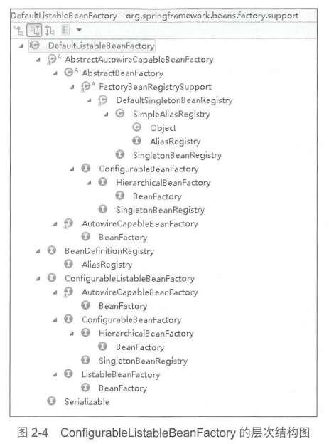
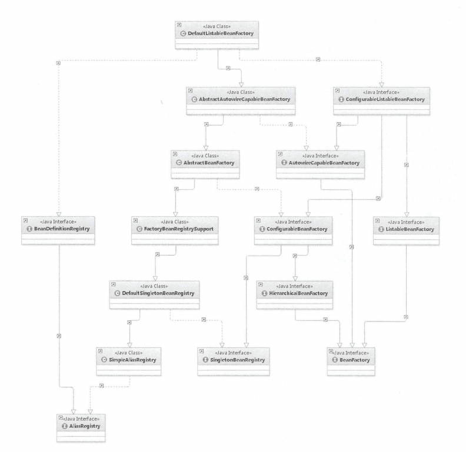
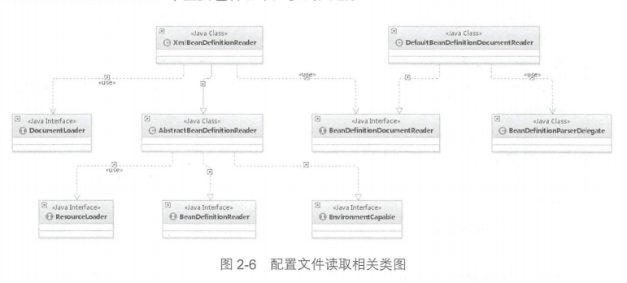

# 容器的基本用法
bean是Spring种最核心的东西，因为Spring就像是个大水桶，而bean就像是容器里的水。水桶脱离了水也就没有意义了。

定义：
```
public class MyTestBean { 
    private String testStr = ” testSt r ”; 
    public String getTestStr () { 
        return testStr;
    } 
    public void setTestStr(Str ng testStr) { 
        this . testStr = testStr;
    }
} 
```
Spring的目的就是让我们的bean成为一个纯粹的POJO，下面的xml配置文件
```
<bean id="myTestBean" class="bean.MyTestBean” />
```
这里就对bean进行了声明

下面是测试代码：
```
SuppressWarnings("deprecation")
public class BeanFactoryTest ( 
    @Test 
    public void testSirnpleLoad() ( 
        BeanFactory bf = new XrnlBeanFactory (new ClassPathResource (”beanFactoryTest.xml”））；
        MyTestBean bean=(MyTestBean ) bf.getBean （” rnyTestBea ”）；
        assertEquals (”testStr ”, bean getTestStr()) ;
    }
} 
```
这段代码的结果是：显示Green Bar

# 功能分析
以上的测试代码主要体现了这几个工作
- 读取自己直文件 beanFactoryTest.xml。 
- 根据 beanFactoryTest.xml 中的配置找到对应的类的配置，并实例化
- 调用实例化后的实例

这里定义了三个类，ReflectionUtil,ConfigReader,App,其中前两者互相没有关联关系，并同时指向第三者
- ConfigReader ：用于读取及验证配置文件 我们要用配置文件里面的东西，当然首先要做的就是读取，然后放置在内存中
- ReflectionUtil ：用于根据配置文件中的配置进行反射实例化 比如在上例中beanFactoryTest.xml 出现的 
<bean id ＝”myTestBean" class＝"bean.MyTestBean" ／＞，我们就可以根据 bean.MyTestBean 进行实例化
- App ：用于完成整个逻辑的串联

# 工程搭建（略）
# Spring的结构组成
## beans包的层级关系
主要有这几种结构
- src/main/java 用于展现 Spring 的主要逻辑
- src/main/resources 用于存放系统的配置文件
- src/test/java 用于对主要逻辑进行单元测试
- src/test/resources 用于存放测试用的配直文件
## 核心类介绍
### DefaultListAbleBeanFactory
1. XmlBeanFactory继承自DefaultListAbleBeanFactory，而后者是整个bean的加载的核心部分，是Spring注册以及加载bean的默认实现。
2. XmlBeanFactory采用自定义的XML读取器XMLBeanDefinitionReader，实现个性化的BeanDefinitionReader.
3. DefaultListableBeanFactory继承了AbstractAutowireCapableBeanFactory 并实现了 ConfigurableListableBeanFactory以及
   BeanDefinitionRegistry接口


这里简单介绍一下2图中个各类的作用
- AliasRegestry:定义对alias的简单增删改操作
- SimpleAliasRegistry：主要使用map作为alias的缓存，并对接口ALiasRegistry进行实现
- SingletonBeanRegistry：定义对单例的注册和获取
- BeanFactory：定义获取bean以及bean的各种属性
- DefaultSingletonBeanRegistry：对接口SingletonBeanRegistry各函数的实现。
- HierarchicalBeanFactory：继承BeanFactory，在BeanFactory定义的功能基础上增加对parentFactory支持
- BeanDefinitionRegistry：定义对BeanDefinition的各种增删改操作
- FactoryBeanRegistrySupport：在DefaultSingletonBeanRegistry基础上增加对FactoryBean的特殊处理能力
- ConfigurableBeanFactory：提供配置Factory的各种方法
- ListableBeanFactory：根据各种条件获取bean的配置清单
- AbstractBeanFactory：综合FactoryBeanRegistrySupport和ConfigurableBeanFactory的功能
- AutowireCapableBeanFactory：提供创建bean、自动注入、初始化以及应用bean的后处理器
- AbstractAutowireCapableBeanFactory：综合AbstractBeanFactory并对接口Autowire CapableBeanFactory进行实现
- ConfigurableListableBeanFactory：BeanFactory配置清单，制定忽略类型以及接口
- DefaultListAbleBeanFactory：综合上面所有功能，主要是对bean注册后的处理。

XmlBeanFactoryDefault对ListableBeanFactory 类进行了扩展，主要用于从 XML 文档中读取BeanDefinition ，
对于注册及获取 bean 都是使用从父类 DefaultListableBeanFactory 继承的方法去实现，而唯独与父类不同的个性化实现
就是增加了 XmlBeanDefinitionReader 类型的 reader属性。在XmlBeanFactory 中主要使用 reader 属性对资源文件进行
读取和注册
### XmlBeanDefinitionReader
XML 配置文件的读取是 Spring 重要的功能 ，因为 Spring 的大部分功能都是以配置作为切入点的，那么我们可以从 
XmlBeanDefinitionReader 中梳理一下资源文件读取、解析及注册的大致脉络
- ResourceLoader ：定义资源加载器，主妥应用于根据给定的资源文件地址返回对应的Resource
- BeanDefinitionReader ：主要定义资源文件读取并转换为 BeanDefinition 的各个功能
- EnvironmentCapable ：定义获取 Environment 方法
- DocumentLoader ：定义从资源、文件加载到转换为 Document 的功能
- AbstractBeanDefinitionReader ：对 EnvironmentCapableBeanDefinitionReader 类定义的功能进行实现
- BeanDefinitionDocumentReader ：定义读取 Docuemnt 并注册 BeanDefinition 功能
- BeanDefinitionParserDelegate ：定义解析 Element 的各种方法
大概流程如下

1. 通过继承自AbstractBeanDefinitionReader方法，来使用ResourceLoader将资源文件转换为对应的resource文件
2. 通过DocumentLoader对Resource文件进行转换，将Resource转换成Document
3. 通过实现BeanDefinitionDocumentReader的DefaultBeanDefinitionDocumentReader类，对Document进行解析。
4. 使用BeandefinitionParserDelegate对Element进行解析
[^_^] 截止2020.2.13